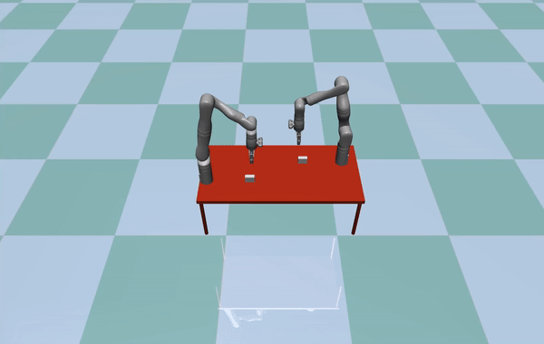

# mujoco-stacking-object

Demonstration of stacking objects with MuJoCo.

This Python project uses MuJoCo simulation to control **two** [six degrees of freedom Gen3 robotic arm](https://www.kinovarobotics.com/product/gen3-robots) to stack objects.
