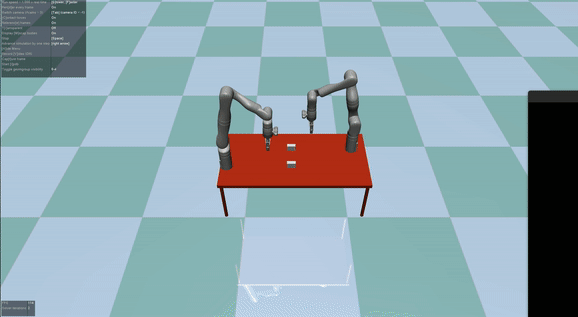

# mujoco-multi-arms

Demonstration of multi-arms with MuJoCo.


This Python project uses MuJoCo simulation to control **two** [six degrees of freedom Gen3 robotic arm](https://www.kinovarobotics.com/product/gen3-robots) with pick-and-place action. For instructions on running the program, please see below.

## Install requirements

```bash
pip install -r ./requirements.txt
```

## Start demo on a specific action

```bash
cp -R ./gen3 /tmp
export LD_LIBRARY_PATH=$LD_LIBRARY_PATH:/home/khiem/.mujoco/mujoco210/bin
export LD_LIBRARY_PATH=$LD_LIBRARY_PATH:/usr/lib/nvidia
export LD_PRELOAD=/usr/lib/x86_64-linux-gnu/libGLEW.so
python3 ./gen3_multi_arms.py
```

## Acknowledgement

This repository is developed from [Dr. Cui](https://www.jindacui.com/bio) source code.